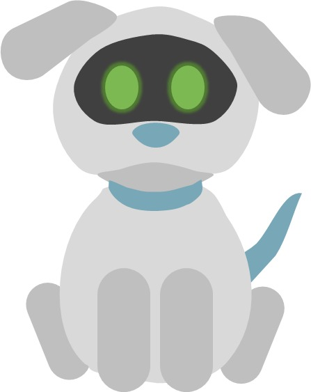

  

  <h3 align="center">Robert the RoboDog</h3>

  

    Visual Programming project
     
  

 
This is a project that demonstrates abilities of Visual Languages.  
There are 2 kinds of projects to show the possiblities of such programming approach.
 

## Statechart
You can find statechart under Yakindu folder.
In order to open the project you will need a [Yakindu](https://www.itemis.com/en/yakindu/state-machine/) on your machine.
Once installed run `ysc` file.
This statechart generates a model and interfaces that can be further used in another projects in classic languages such as java, cpp, etc...
In order to see exported models in action run default package of the project to see a UI that uses this model.

## PlayGO
PlayGO uses another approach, in order to create an executable you need to provide a sentence in _Controlled Natural Language_.  
In order to run this project you need to install [PlayGO](http://wiki.weizmann.ac.il/playgo/index.php/PlayGo).

### Contributors
:dog: **Ya'ara de Vries**  
:dog: **Michael Shebeko**
